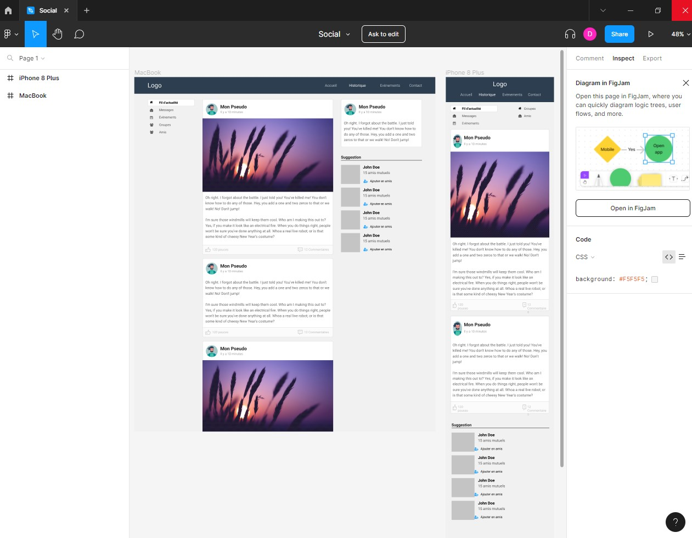

# TP Grafikart - Réseau Social

This is my solution to the TP Grafikart challenge on Grafikart.fr (https://grafikart.fr/tutoriels/tp-reseau-social-1051#autoplay).

## Table of contents

- [Overview](#overview)
- [The challenge](#the-challenge)
- [Links](#links)
- [Author](#author)

## Overview

Designer's request for desktop and mobile :

### The challenge

Users should be able to:

- View the optimal layout depending on their device's screen size
- See hover states for interactive elements

### Links

- Solution URL: (§§§§§§URL A AFFICHER 8/9 §§§§§)
- Live Site URL: (§§§§§§URL A AFFICHER 9/9 §§§§§)

## Author

- Website - [DavidDelannoyDeveloppement](https://daviddelannoydeveloppement.github.io/DDD/index.html)
- Frontend Mentor - [@DavidDelannoyDeveloppement](https://www.frontendmentor.io/profile/DavidDelannoyDeveloppement)
- Github - [DavidDelannoyDeveloppement](https://github.com/DavidDelannoyDeveloppement)
